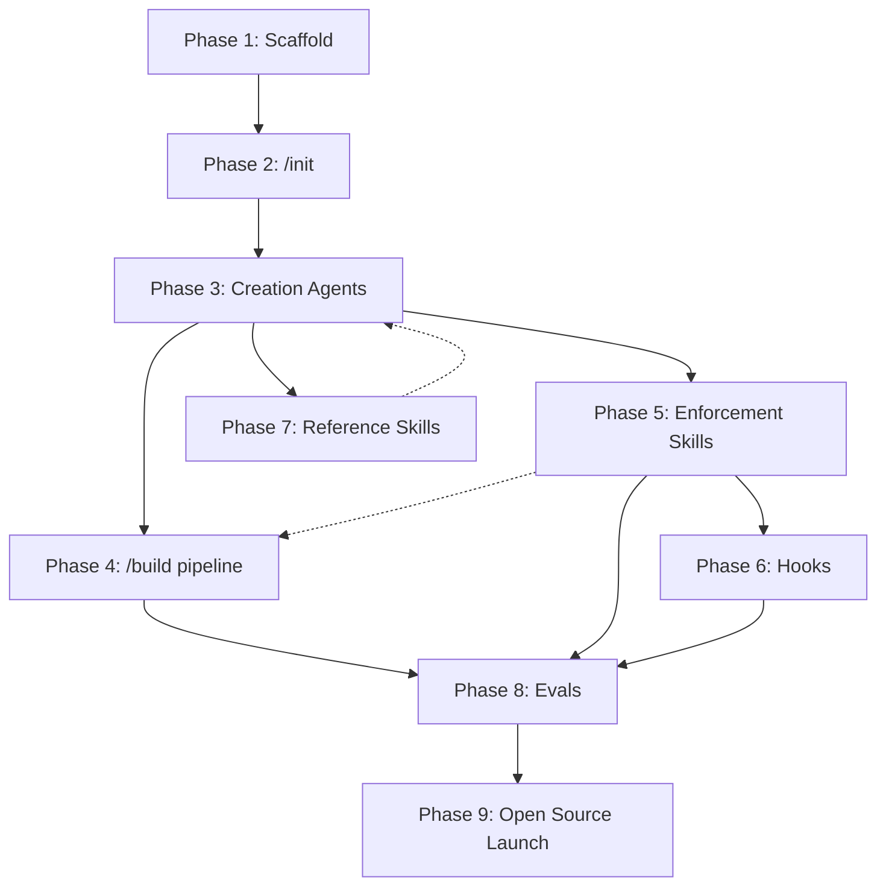

# React Craft Plugin — Implementation Plan (Deepened)

## Enhancement Summary

**Deepened on:** 2026-03-11
**Research agents used:** 12 (linting, a11y, Context7 strategy, commit format + memory, architecture, simplicity, spec flow, pattern recognition, security, TypeScript, agent-native, performance)

### Key Improvements
1. **Security invariants** added throughout — sanitization for Figma data, hook commands, config values, and file paths (2 critical, 3 high findings addressed)
2. **Two-tier validation system** — Biome internally for speed, user's linter externally for compatibility
3. **Structured output sidecars** — YAML alongside every markdown artifact for agent-native composability
4. **Workaround memory system** — `docs/workarounds/` + `.claude/rules/` for learning from corrections
5. **Commit strategy** — `feat(react-craft):` with git trailers for traceability
6. **Prerequisite validation** — fail fast if React, Storybook, or Figma MCP are missing
7. **Terminal states defined** for all remediation loops
8. **TypeScript ruleset codified** — zero `any`, discriminated unions over boolean flags, two-pass type checking
9. **Context7 elevated to first-class** — library IDs configured per agent
10. **8-layer a11y testing stack** — from eslint-plugin-jsx-a11y (ms) to Guidepup screen reader automation
11. **Team dynamics** — agents are teammates, not isolated subagents: shared charter, named handoff notes, push-back protocol, shared vocabulary, team roster awareness

### Scope Assessment (from Simplicity Review)
The simplicity reviewer recommends cutting to 4 phases for v0.1 (scaffold+init, 4-agent pipeline, lightweight audit, README). The full 9-phase plan is preserved below with v0.1/v0.2/v0.3 annotations on each phase so you can choose your cut line.

### New Cross-Cutting Concerns
These items span multiple phases and should be addressed before Phase 3:
- [ ] **CC.1** Fix config naming: search-and-replace ALL references to use `react-craft.config.yaml` consistently (brainstorm has `frontend-craft.config.md`, plan has `react-craft.config.md` in places)
- [ ] **CC.2** Define sanitization module for Figma-sourced strings: component names `^[A-Z][a-zA-Z0-9]*$`, variant names `^[a-zA-Z0-9_-]+$`, text content escaped for JSX
- [ ] **CC.3** Define agent exit schema (YAML sidecar): `status`, `exit_code`, `findings[]`, `gate_passed`, `pending_actions[]`
- [ ] **CC.4** Add path canonicalization: all output paths must resolve within `$PROJECT_ROOT`, reject `../`, null bytes
- [ ] **CC.5** Define global iteration budget: max 10 total re-invocations across all remediation loops per pipeline run
- [ ] **CC.6** Write the Team Charter (see below) — the shared document all agent prompts include

---

## Team Dynamics — How Agents Work Together

> The agents are not isolated subagents running in sequence. They are a **team of specialists** who know each other, reference each other's work, anticipate each other's needs, and share a design philosophy. Every agent prompt includes the Team Charter and the Team Roster.

### Team Charter

Create `plugins/react-craft/team/charter.md` — loaded into every agent's context as the first thing they read.

```markdown
# react-craft Team Charter

You are a member of the react-craft team — a group of specialists who
collaborate to build production-quality React components from design specs.

## Shared Values
1. **Semantic HTML first.** Platform features before JS workarounds.
2. **Mobile-first.** Design for the smallest screen, enhance upward.
3. **Accessibility is not optional.** WCAG AA is the floor, not the ceiling.
4. **Tokens over hardcoded values.** If the design system defines it, use it.
5. **Simplicity over sophistication.** Three clear lines beat one clever abstraction.
6. **Don't guess — ask.** Missing info is a stop signal, not a fill-in-the-blank.
7. **Leave the codebase better than you found it.**

## How We Work Together
- Read your teammates' output carefully. They put thought into it.
- If you disagree with an upstream decision, say so in your handoff notes
  with a specific reason and a concrete alternative. Don't silently undo
  someone else's work.
- Leave handoff notes for the teammates who will consume your output.
  Name them directly: "Note for Code Writer: ..." or "Heads up for
  A11y Auditor: ..."
- When you find an issue that belongs to another teammate's domain,
  flag it — don't fix it yourself unless it's blocking your work.
- Quality is everyone's job, not just the Quality Gate's.

## Project Context
The team reads `react-craft.config.yaml` for project-specific conventions
and `docs/react-craft/components/<ComponentName>/` for the current
component's accumulated knowledge.
```

### Team Roster

Create `plugins/react-craft/team/roster.md` — also loaded into every agent's context.

```markdown
# react-craft Team Roster

## Your Teammates

**Design Analyst** — Extracts and validates the design spec from Figma.
Produces the component brief. Won't let anything through without complete
specs — if something is ambiguous, they stop and ask the human. Their
brief is your source of truth for what the component should look like
and how it should behave.

**Component Architect** — Designs the component API: prop interfaces,
composition strategy, file structure. Researches existing libraries
(Radix, React Aria) to avoid reinventing the wheel. If they chose a
compound component pattern or a specific library, there's a reason —
read their architecture.md before overriding.

**Code Writer** — Implements the component following the brief and
architecture spec. Writes clean, conventional TypeScript that respects
the project's styling method, naming patterns, and token system. If
they made a tradeoff, they'll explain it in handoff notes.

**Accessibility Auditor** — Reviews the generated code from the
perspective of users with disabilities. Runs automated checks (axe-core,
keyboard tests, screen reader verification) and flags what automation
can't catch. Their P1 findings are non-negotiable blockers.

**Story Author** — Creates Storybook stories covering every state, edge
case, and interaction. Thinks like a QA engineer: what breaks with long
text? Empty content? RTL? Their stories are both documentation and
regression tests.

**Visual Reviewer** — Compares the rendered component against the Figma
design pixel-by-pixel. Focuses on the 9 dimensions: layout, typography,
colors, spacing, shadows, borders, radius, icons, states. Knows when
to stop iterating.

**Quality Gate** — Runs the project's own toolchain: TypeScript, linter,
formatter, Storybook tests, bundle size. The final mechanical check
before the component is ready for human review.
```

### Team Behaviors — What Changes in Each Agent Prompt

Each agent prompt must include three sections that enable team behavior:

#### 1. Team Context Block (top of every agent prompt)
```markdown
{{include team/charter.md}}
{{include team/roster.md}}

You are the [Agent Name]. Here's what your teammates have done so far
on this component:
- Design Analyst produced: brief.md [summary of key decisions]
- Component Architect produced: architecture.md [summary of key decisions]
- [etc. for all completed agents]
```

#### 2. Upstream Awareness (read and reference previous work)
Each agent reads not just the artifact, but the **handoff notes** from the previous agent. Example for Code Writer:
```markdown
## Before You Start
1. Read brief.md — this is your spec. The Design Analyst verified it's complete.
2. Read architecture.md — the Component Architect designed the API. Follow their
   prop interface and composition strategy unless you have a strong technical
   reason not to (and if so, explain in your handoff notes).
3. Check for handoff notes addressed to you: "Note for Code Writer: ..."
4. Read react-craft.config.yaml for project conventions.
```

#### 3. Handoff Notes (leave context for downstream teammates)
Every agent appends a `## Handoff Notes` section to their output:
```markdown
## Handoff Notes

**For Code Writer:**
- I chose a compound component pattern for the Select because it needs
  to support custom option rendering. See architecture.md §Composition.
- The brief says "animation: slide down" but the project has no motion
  library. Consider CSS transitions with prefers-reduced-motion.

**For Accessibility Auditor:**
- The dropdown uses Radix Popover internally — focus trapping and keyboard
  nav are handled by the library. Focus your review on the custom trigger
  button and the option selection pattern.

**For Story Author:**
- There are 4 variants × 3 sizes × 5 states = 60 combinations. I'd
  recommend a matrix story rather than 60 individual stories.
```

#### 4. Push-Back Protocol
Any agent can flag a concern about upstream work. This goes in their output as a structured section:

```markdown
## Upstream Feedback

**To Component Architect** (from Code Writer):
- Issue: The architecture specifies a generic `<Select<T>>` with a type
  parameter, but the brief only shows string options. This adds complexity
  without a concrete use case.
- Suggestion: Use `value: string` for v1. Add generics if a real use case
  emerges.
- Severity: suggestion (I implemented it as specified but flagged for review)
```

Push-back severity levels:
- **blocking**: "I can't proceed without resolution" → pipeline pauses, asks human
- **concern**: "I proceeded but this should be reviewed" → flagged in review.md
- **suggestion**: "Consider this for next time" → logged for team learning

#### 5. Shared Vocabulary
The team uses consistent terminology (defined in charter):
- **brief** (not "spec", "design doc", or "requirements") — the Design Analyst's output
- **architecture** (not "plan", "design", or "structure") — the Component Architect's output
- **finding** (not "issue", "bug", or "error") — any agent's quality observation
- **deviation** (not "violation" or "break") — intentional departure from DS rules
- **gate** (not "check" or "test") — a pass/fail quality checkpoint

### Implementation Tasks

- [ ] **CC.6.1** Write `plugins/react-craft/team/charter.md`
- [ ] **CC.6.2** Write `plugins/react-craft/team/roster.md`
- [ ] **CC.6.3** Define handoff notes format (markdown section with named recipients)
- [ ] **CC.6.4** Define push-back protocol (blocking / concern / suggestion)
- [ ] **CC.6.5** Define shared vocabulary glossary
- [ ] **CC.6.6** Add `{{include team/charter.md}}` and `{{include team/roster.md}}` to every agent prompt template
- [ ] **CC.6.7** Add "Upstream Awareness" section to each agent prompt specifying which artifacts to read and what to look for
- [ ] **CC.6.8** Add "Handoff Notes" output requirement to each agent prompt
- [ ] **CC.6.9** Test: Run full pipeline and verify handoff notes flow between agents — Design Analyst leaves notes for Component Architect, Component Architect leaves notes for Code Writer, etc.
- [ ] **CC.6.10** Test: Deliberately create a scenario where Code Writer should push back on Component Architect (over-complex API for simple component) — verify the push-back appears in output

---

## Phase 1: Plugin Scaffold & Marketplace Setup
> Goal: A valid, installable Claude Code plugin with no functionality yet.
> **Scope: v0.1**

- [ ] **1.1** Initialize git repo in this directory
- [ ] **1.2** Create marketplace structure:
  ```
  .claude-plugin/marketplace.json
  plugins/react-craft/.claude-plugin/plugin.json
  plugins/react-craft/README.md
  plugins/react-craft/CHANGELOG.md
  plugins/react-craft/LICENSE (MIT — confirmed)
  ```
- [ ] **1.3** Write `plugin.json` with metadata (name, version 0.1.0, description, author, keywords, homepage)
- [ ] **1.4** Write `marketplace.json` following Claude Code spec (name, owner, metadata, plugins array)
- [ ] **1.5** Verify local installation works: `claude /plugin marketplace add <path>` + `claude /plugin install react-craft`
- [ ] **1.6** Create initial README with vision statement, installation instructions, and compatibility matrix (standalone / +CE / +BMAD)

### Research Insights

**Plugin-level CLAUDE.md:**
- [ ] **1.7** Ship a plugin-level `plugins/react-craft/CLAUDE.md` with baseline behavioral instructions for when the plugin is active (pattern recognition review identified this gap)

**Plugin code quality tooling:**
- [ ] **1.8** Add JSON Schema for `react-craft.config.yaml` — used for config validation in `/init` and by every agent on load
- [ ] **1.9** Add JSON Schema for `hooks.json` — validates hook definitions at install time

**Security (from security audit):**
- [ ] **1.10** Create `SECURITY.md` covering: trust boundaries, what the plugin can access, how to report vulnerabilities, security-sensitive files (config, CLAUDE.md, hooks.json)

### Deliverable
A plugin that installs and shows up in Claude Code with zero commands/agents, plus validation schemas and security documentation.

---

## Phase 2: `/react-craft:init` Command
> Goal: Detect codebase setup and write `react-craft.config.yaml` + update CLAUDE.md as the constitutional documents all agents read.
> **Scope: v0.1**

- [ ] **2.1** Create `plugins/react-craft/commands/init.md`
- [ ] **2.2** Detection logic (via Bash file-existence checks + grep):
  - Styling method: Tailwind (tailwind.config), CSS Modules (*.module.css), styled-components (package.json dep), vanilla CSS
  - Component naming: scan existing components for PascalCase/kebab-case patterns
  - Prop naming: scan for camelCase/kebab-case prop conventions
  - CSS class naming: scan for BEM, utility-first, or other patterns
  - Design tokens: check for DTCG `.tokens.json`, CSS custom properties, Tailwind theme
  - Storybook config: detect version, addons, story naming convention
  - Design system library: check package.json for MUI, Radix, Chakra, Headless UI, etc.
  - Available scripts: detect lint, format, test, storybook commands from package.json
  - i18n framework: detect react-intl, i18next, next-intl, vue-i18n from imports
  - Content strategy: detect tone guides, terminology files, content docs

### Research Insights: Prerequisite Validation (spec flow analysis)

- [ ] **2.2.1** **React detection gate:** Check `package.json` for `react` dependency. If absent, warn: "react-craft is designed for React projects. Detected framework: [X]. Proceed anyway? (not recommended)"
- [ ] **2.2.2** **Storybook detection gate:** If Storybook is not installed, warn with installation instructions. Four of seven agents depend on Storybook — the pipeline is fundamentally limited without it.
- [ ] **2.2.3** **Figma MCP detection:** Check for Figma Console MCP and Official Figma MCP availability. If neither is configured, warn that `/build` will only work with Anova YAML exports.
- [ ] **2.2.4** **Node.js/npm detection:** Verify node_modules exists and Node.js is available.
- [ ] **2.2.5** **Context7 MCP detection:** Check if Context7 MCP is available. Configure library IDs for project dependencies if so.
- [ ] **2.2.6** **Linter detection:** Detect ESLint flat config (`eslint.config.*`), Biome (`biome.json`), Prettier (`.prettierrc*`), Stylelint (`.stylelintrc*`)
- [ ] **2.2.7** **Pre-commit hook detection:** Detect Husky (`.husky/`), Lefthook (`lefthook.yml`), or lint-staged config. Do NOT overwrite existing hooks.

### Research Insights: Headless/Automated Mode (agent-native review)

- [ ] **2.3** Interactive prompts for what can't be detected:
  - Where do design tokens live?
  - What's the component directory structure?
  - Any content strategy / i18n setup?
  - Figma Console MCP vs Official Figma MCP availability?
- [ ] **2.3.1** **Support `--defaults` flag** that skips interactive prompts and uses sensible defaults. This enables CI and agent-driven setup.
- [ ] **2.3.2** **Support `--config <path>` flag** that applies a pre-filled config file, enabling automated onboarding.

### Research Insights: Config Schema (pattern recognition + architecture reviews)

- [ ] **2.4** Write `react-craft.config.yaml` (not markdown — YAML for machine parsing, following prior toolkit pattern):
  - `design_system` section: name, version, storybook_url, manifest_cache, component_prefix, **support_channel** (URL), **support_label** (human-readable)
  - `detection` section: styling method, component_naming, prop_naming, linter, formatter, framework_version *(NEW — pattern recognition identified this gap)*
  - `scripts` section: lint, format, typecheck, storybook_test, build commands *(NEW — detected from package.json, used by Quality Gate)*
  - `agents` section: per-agent enabled/disabled *(NEW — e.g., disable visual-reviewer if no Figma MCP)*
  - `skills` section: per-skill enabled/disabled + config
  - `pipeline` section: ordered list of agents + skills + custom skill slots
  - `hooks` section: post_edit, pre_commit with file patterns and severity gates
  - `scope` and `severity` sections
  - `allowlist` for known intentional deviations
  - `accessibility` section: target WCAG level (default: AA), headless_library (react-aria/radix/none), skip_when_headless list *(NEW — a11y research)*
  - `context7` section: library IDs for detected dependencies *(NEW)*
- [ ] **2.4.1** Validate generated YAML against JSON Schema from step 1.8 before writing
- [ ] **2.4.2** **Display detected script commands** to the user and require confirmation before adding to config (security: prevents malicious package.json scripts from being auto-trusted)
- [ ] **2.4.3** **Validate `support_channel` URL** — https only, known domains (slack.com, teams.microsoft.com, discord.com) *(security audit finding 4)*

### Research Insights: Re-initialization (spec flow analysis)

- [ ] **2.4.4** **Idempotent re-init:** Detect existing `react-craft.config.yaml`. If found, show diff of proposed changes and ask user to confirm merge/overwrite/cancel. Never silently overwrite custom pipeline configurations, allowlists, or custom skill entries.
- [ ] **2.4.5** **Config versioning:** Add a `config_version: 1` field. Future plugin versions can detect and migrate older configs.

- [ ] **2.5** Prompt for DS team support channel URL + label (e.g., "#design-system-help on Slack")

### Research Insights: CLAUDE.md Safety (security audit finding 8)

- [ ] **2.6** Add CLAUDE.md instructions for semantic hooks (post-edit token checking, pre-commit audit reminder)
  - **Delimit with markers:** `<!-- react-craft:start -->` / `<!-- react-craft:end -->` so additions are auditable and idempotent
  - **Write only static, hardcoded strings** — no user input or Figma data flows into CLAUDE.md
  - **Display additions to user** for approval before writing

### Research Insights: Hook Security (security audit finding 1 — CRITICAL)

- [ ] **2.7** Generate `hooks/hooks.json` for shell-based fast checks (hardcoded color grep, commit warning)
  - **Sanitize all `$TOOL_INPUT_*` variables** — validate against `^[a-zA-Z0-9_./-]+$` before use
  - **Use `printf '%s'` instead of `echo`** for variable output (echo interprets escape sequences)
  - **Ship a sanitization function** that all hooks must use
- [ ] **2.8** Test: run `/react-craft:init` on 3 different project types (Tailwind + Radix, CSS Modules + custom, styled-components + MUI)

### Research Insights: Workaround Memory System (commit format + memory research)

- [ ] **2.9** Create `docs/workarounds/` directory structure during init:
  ```
  docs/workarounds/
    index.md                    # Auto-generated table of all workarounds
    storybook/
    a11y/
    figma/
    tokens/
    react/
    build/
  ```
- [ ] **2.10** Create `.claude/rules/react-craft-known-issues.rule` — concise file (max 50 lines) loaded every session with one-line summaries of active workarounds, linking to full docs

### Deliverable
Running `/react-craft:init` produces `react-craft.config.yaml` (validated), updates CLAUDE.md (with markers), configures hooks (sanitized), and sets up the workaround memory system.

---

## Phase 3: Core Agents (Team Build)
> Goal: Build each agent as a team member — aware of teammates, reading upstream work, leaving handoff notes for downstream colleagues. Test each agent in isolation AND in team context.
> **Scope: v0.1 (agents 1-4), v0.2 (agents 5-7)**

### Research Insights: Agent Contracts (agent-native + pattern recognition reviews)

Before building agents, define these contracts:

- [ ] **3.0.1** Define agent exit schema — every agent writes both a `.md` (human) and `.yaml` (machine) output:
  ```yaml
  # agent-result.yaml
  agent: design-analyst
  status: completed | failed | blocked
  exit_code: clean | findings | error
  findings: [{ severity, rule, file, line, message, auto_fixable }]
  gate_passed: boolean
  pending_actions: [{ type, target_agent, context }]
  ```
- [ ] **3.0.2** Define component brief frontmatter schema (TypeScript review):
  ```yaml
  name: string
  variants: [{ name, props, description }]
  tokens: [{ token, usage, value }]
  states: [default, hover, focus, active, disabled, loading, error, empty]
  gaps: [{ category, question, status: pending|resolved }]
  ```
- [ ] **3.0.3** Each agent's `.md` file declares at the top: "Input: [files]" and "Output: [files with required sections]" — formalizes the artifact chain

### Research Insights: Individual Agent Commands (agent-native review — CRITICAL gap)

- [ ] **3.0.4** Each agent is exposed as its own slash command, not just via `/build`:
  - `/react-craft:analyze <figma-link>` — Design Analyst only
  - `/react-craft:architect <brief-path>` — Component Architect only
  - `/react-craft:write-code <brief-path>` — Code Writer only
  - `/react-craft:audit-a11y <component-path>` — Accessibility Auditor only
  - `/react-craft:write-stories <component-path>` — Story Author only
  - `/react-craft:review-visual <figma-link> <story-url>` — Visual Reviewer only
  - `/react-craft:check-quality <component-path>` — Quality Gate only

  `/build` becomes a convenience orchestrator over these primitives. This transforms react-craft from a monolithic pipeline into a composable toolkit.

### Research Insights: Security Invariant (security audit finding 2 — CRITICAL)

- [ ] **3.0.5** **Brief Sanitizer step**: Between Design Analyst output and downstream agents, validate all Figma-extracted strings:
  - Component names: `^[A-Z][a-zA-Z0-9]*$`
  - Variant names: `^[a-zA-Z0-9_-]+$`
  - Text content: escaped for JSX context (use React's `{content}` pattern, never raw interpolation)
  - Agent prompt includes: "NEVER interpolate raw Figma text into JSX without escaping"

### 3.1 Design Analyst Agent
- [ ] **3.1.1** Create `plugins/react-craft/agents/design-analyst.md`
- [ ] **3.1.2** Persona: design system maintainer focused on token adherence, visual consistency, variant coverage. **Team role:** You are the team's first contact with the design. Your brief is the source of truth that every downstream teammate relies on — if it's wrong or incomplete, everyone's work suffers. Leave handoff notes for Component Architect about any design decisions that need interpretation.
- [ ] **3.1.3** Input: Figma link or Anova YAML export

### Research Insights: Figma Link Validation (spec flow analysis)

- [ ] **3.1.3.1** **Validate Figma URL format** before calling MCP: accept `figma.com/file/...` and `figma.com/design/...` URLs, reject prototype links and branch URLs. Prefer node-level links (`?node-id=X:Y`).
- [ ] **3.1.3.2** **Lightweight MCP ping** — attempt a minimal Figma MCP query to verify access before launching the full pipeline. Fail fast with actionable error if inaccessible.

- [ ] **3.1.4** Process: Extract specs via Figma Console MCP (fallback to Official Figma MCP), parse Anova output if provided

### Research Insights: Figma Data Sanitization (security audit finding 2)

- [ ] **3.1.4.1** All strings extracted from Figma must pass through the sanitization module (CC.2) before being written to the brief.

- [ ] **3.1.5** **Critical action: NEVER fill gaps by guessing.** After extracting what Figma provides, the agent must audit the brief for completeness against a checklist:
  - [ ] All interactive states documented? (hover, focus, active, disabled)
  - [ ] Loading, error, and empty states defined?
  - [ ] Responsive behavior specified? (breakpoints, reflow, hiding)
  - [ ] Motion/animation intent clear? (or explicitly "none")
  - [ ] Content rules known? (min/max lengths, truncation, i18n)
  - [ ] Keyboard interaction pattern defined?
  - [ ] Token mapping complete? (no ambiguous "looks like gray")

  For each gap, the agent **stops and asks the human**, requesting:
  - A specific answer ("What happens to this component below 768px?")
  - Or a link to a specific Figma frame/node that clarifies it

### Research Insights: Best-Effort Mode (agent-native review)

- [ ] **3.1.5.1** Support `--best-effort` flag: instead of blocking on missing info, document assumptions in a structured `assumptions.yaml` file and proceed. Downstream agents or humans review assumptions later. This enables fully automated pipelines with post-hoc review.

### Research Insights: Color Contrast Pre-check (a11y research)

- [ ] **3.1.5.2** Extract color tokens from Figma and pre-validate contrast ratios against WCAG AA thresholds (4.5:1 normal text, 3:1 large text, 3:1 UI components) before code generation begins. Flag failing combinations in the brief.

### Research Insights: Complexity Assessment (spec flow analysis)

- [ ] **3.1.5.3** Design Analyst assesses component complexity (simple/medium/complex) based on: variant count, state count, responsive requirements, composition needs. This determines pipeline routing in Phase 4. User can override via `--complexity=` flag.

- [ ] **3.1.6** Output: Structured component brief (markdown + YAML sidecar) including:
  - Component name, description, purpose
  - All variants with visual diffs (from Anova)
  - Design tokens used (colors, spacing, typography, shadows)
  - Responsive behavior notes
  - Motion/animation specs
  - States: default, hover, focus, active, disabled, loading, error, empty
  - Content requirements (min/max lengths, truncation rules)
  - **Gaps section**: any items the human still needs to clarify, marked `[PENDING]`
  - **Complexity assessment**: simple/medium/complex with reasoning
  - **Color contrast pre-check results**
- [ ] **3.1.7** **Gate: Do not proceed to Component Architect until all `[PENDING]` items are resolved.** The brief must be complete before downstream agents consume it.
- [ ] **3.1.8** Template: `plugins/react-craft/templates/component-brief.md` (include the completeness checklist)
- [ ] **3.1.9** Test: Run against a Material Design button component in Figma
- [ ] **3.1.10** Test: Run against a component with intentionally incomplete Figma specs, verify agent asks questions instead of guessing

### Research Insights: Adversarial Testing (security audit)

- [ ] **3.1.11** Test: Run against a Figma component with adversarial names (shell metacharacters, path traversal, JSX injection) — verify sanitization rejects or escapes them

### 3.2 Component Architect Agent
- [ ] **3.2.1** Create `plugins/react-craft/agents/component-architect.md`
- [ ] **3.2.2** Persona: library author focused on API ergonomics, composability, prop naming. **Team role:** You translate design intent into a buildable architecture. Read the Design Analyst's brief and handoff notes carefully. Leave detailed handoff notes for Code Writer (implementation guidance) and Accessibility Auditor (ARIA patterns you've chosen). If the brief is missing something you need, push back to Design Analyst rather than guessing.
- [ ] **3.2.3** Input: Component brief from Design Analyst + `react-craft.config.yaml`
- [ ] **3.2.4** Process:
  - Break complex components into atomic parts (identify composition opportunities)
  - Define TypeScript prop interface with JSDoc
  - Map variants to props (boolean flags vs. union types vs. compound components)
  - Check existing component inventory (from config) for reuse opportunities
  - For complex components: research existing libraries (Radix, Headless UI, React Aria, etc.) via web search + Context7

### Research Insights: Variant Mapping Rules (TypeScript review)

- [ ] **3.2.4.1** **Explicit preference order** for variant-to-prop mapping:
  1. **Discriminated union** for mutually exclusive variants: `variant: 'primary' | 'secondary' | 'ghost'`
  2. **Compound components** for compositional patterns: `<Select><Select.Option /></Select>`
  3. **Boolean flags** ONLY for truly independent binary states: `disabled`, `loading`

  Never generate conflicting booleans like `<Button primary secondary>`.

### Research Insights: Context7 Integration (Context7 research)

- [ ] **3.2.4.2** Query Context7 for the specific component type being built — e.g., Radix Dialog docs when building a modal, React Aria useCombobox when building a select. Cache results to `docs/react-craft/components/<Name>/research.md` so downstream agents don't re-query.

- [ ] **3.2.5** Output: **Separate `architecture.md` file** (not appended to brief — pattern recognition review R7):
  - File structure (which files to create)
  - Prop interface (TypeScript)
  - Composition strategy (compound components, render props, slots)
  - Dependencies (existing design system components, external libraries if needed)
  - Accessibility requirements (ARIA roles, keyboard interactions)

### Research Insights: Human Gate for Complex Components (architecture review)

- [ ] **3.2.5.1** For complex-tier components: present the proposed API and file structure for **human approval** before Code Writer proceeds. This is a review checkpoint that prevents expensive rework.

- [ ] **3.2.6** Critical action: MUST prefer existing design system components over creating new ones
- [ ] **3.2.7** When no DS equivalent exists: nudge developer to check with DS team (using `support_channel` from config) before building custom
- [ ] **3.2.8** Test: Run against a complex component (data table with sorting/filtering/pagination)

### 3.3 Code Writer Agent
- [ ] **3.3.1** Create `plugins/react-craft/agents/code-writer.md`
- [ ] **3.3.2** Persona: senior React developer, follows detected conventions. **Team role:** You implement what Design Analyst specified and Component Architect designed. Read both brief.md and architecture.md including their handoff notes to you. If the architecture feels over-engineered for the component's complexity, use the push-back protocol (concern or suggestion level). Leave handoff notes for Accessibility Auditor (any a11y-relevant implementation choices), Story Author (component API nuances, prop defaults), and Quality Gate (any known lint exceptions).
- [ ] **3.3.3** Input: Component brief + architecture.md + `react-craft.config.yaml`

### Research Insights: File Collision Detection (spec flow analysis, CRITICAL)

- [ ] **3.3.3.1** **Before writing any file**, check if target paths already exist. If they do, ask: overwrite, rename, or cancel. Never silently overwrite production code.

- [ ] **3.3.4** Critical actions:
  - Read `react-craft.config.yaml` FIRST for styling method, naming conventions, token usage
  - Semantic HTML elements first (`<button>`, `<nav>`, `<dialog>`, `<details>`)
  - Platform features for forms, hovers, buttons, URLs
  - JS client-side features only when CSS/HTML can't do it
  - Mobile-first responsive with native features
  - `prefers-reduced-motion` for any animation
  - Forward refs, proper TypeScript generics where needed

### Research Insights: TypeScript Ruleset (TypeScript review — add to agent prompt)

- [ ] **3.3.4.1** **TypeScript hard rules for Code Writer prompt:**
  - Zero `any` — use `unknown` with type guards instead
  - Zero `as` type assertions — if you can't type it correctly, the component API is wrong
  - JSDoc on EVERY prop — no exceptions
  - `React.MouseEventHandler<HTMLButtonElement>` for events, never `(e: any) => void`
  - Named function expressions inside `forwardRef`: `const Button = React.forwardRef<HTMLButtonElement, ButtonProps>(function Button(...) {})`
  - `export type` for type-only re-exports in barrel files
  - If you need a conditional type or mapped type: **STOP — the component API is too complex. Simplify or split.**
  - Internal bar: code must pass `strict + noUncheckedIndexedAccess + exactOptionalPropertyTypes` regardless of user's tsconfig
  - Types co-located in component file unless >50 lines, then extract to `ComponentName.types.ts`

### Research Insights: Simplification Directive (architecture review, simplicity review)

- [ ] **3.3.4.2** **Anti-over-engineering rules for Code Writer prompt:**
  - "After generating the component, review it for unnecessary abstractions"
  - "Remove any wrapper component, custom hook, or utility function used exactly once that adds no testability or reuse benefit"
  - "Prefer fewer files. Three similar lines of code is better than a premature abstraction"
  - "Question every indirection. If a pattern looks sophisticated but doesn't solve a concrete problem, remove it"

### Research Insights: Generate-Lint-Fix Loop (linting research)

- [ ] **3.3.4.3** **Two-tier validation during generation:**
  - **Tier 1 (internal, fast):** Run Biome format + lint (~50ms) against generated code. Feed structured diagnostics (file, line, rule, message) back for self-correction. Max 3 iterations.
  - **Tier 2 (user-facing):** Run user's detected linter (ESLint/Biome/Prettier from config `scripts` section). Feed diagnostics back. Max 2 iterations.
  - If user has NO linting setup, use bundled ESLint flat config as fallback.

### Research Insights: CSS Linting (linting research)

- [ ] **3.3.4.4** **Styling-specific validation:**
  - Tailwind: `prettier-plugin-tailwindcss` for class ordering (or `eslint-plugin-tailwindcss`)
  - CSS Modules: Stylelint with `selector-class-pattern` for camelCase
  - styled-components: No additional linting needed (TypeScript catches most issues)

### Research Insights: Context7 for Code Writer (architecture review)

- [ ] **3.3.4.5** Query Context7 for the exact API of: detected Storybook version, styling framework, and component library version BEFORE generating code. Fall back to static references (Phase 7) if Context7 is unavailable.

### Research Insights: Generated Code Attribution (architecture review)

- [ ] **3.3.4.6** Add header comment to generated files:
  ```tsx
  // Generated by react-craft v0.1.0 from Figma <link> on <date>
  // Do not edit manually — re-run /react-craft:build to regenerate
  ```

- [ ] **3.3.5** Output: React component file(s) + index barrel export
- [ ] **3.3.6** Test: Generate a card component with Tailwind, then same with CSS Modules — verify convention adherence

### 3.4 Accessibility Auditor Agent
- [ ] **3.4.1** Create `plugins/react-craft/agents/accessibility-auditor.md`
- [ ] **3.4.2** Persona: user with disabilities — keyboard nav, screen reader, motion sensitivity, color contrast. **Team role:** You are the team's accessibility conscience. Read the brief for intended states and interactions, the architecture for chosen ARIA patterns, and Code Writer's handoff notes about a11y-relevant choices. You review the CODE, not the intent — but knowing the intent helps you distinguish bugs from design decisions. When you find issues, your report helps Code Writer fix them; write findings that are actionable, not just diagnostic. If a P1 issue stems from an architecture decision (not a code bug), push back to Component Architect at "concern" level.
- [ ] **3.4.3** Input: Generated component files + brief.md + architecture.md + Code Writer's handoff notes. (Fresh context from an implementation standpoint — the auditor didn't write the code — but aware of the team's design intent so they can distinguish bugs from deliberate choices.)

### Research Insights: Clear A11y Boundary (pattern recognition review — HIGH)

The Accessibility Auditor, Implementation Checker (Phase 5.3), and Quality Gate all touch a11y. Clear boundaries:
- **Accessibility Auditor (this agent):** Deep interactive audit — axe-core via Storybook, keyboard testing via Playwright, screen reader heuristics. Runs during creation.
- **Implementation Checker (Phase 5):** Static pattern matching only — missing ARIA attributes, missing `prefers-reduced-motion`, missing focus-visible styles. Runs during enforcement.
- **Quality Gate:** Only validates that `storybook test` passes (binary pass/fail), does NOT produce its own a11y findings.

### Research Insights: 8-Layer A11y Testing Stack (a11y research)

- [ ] **3.4.4** Process (layered by speed):
  1. **eslint-plugin-jsx-a11y** (ms) — static JSX analysis, catches missing alt, invalid ARIA, handler issues
  2. **axe-core + JSDOM** (~1s) — structural ARIA checks, no contrast (no layout engine)
  3. **@guidepup/virtual-screen-reader** (~1s) — verify screen reader announcements correct *(NEW)*
  4. **Storybook a11y addon + Vitest** (~5s) — full axe audit with rendering
  5. **@axe-core/playwright** (~5s) — full WCAG 2.2 AA automated checks
  6. **Playwright keyboard tests** (~5s) — tab order, focus traps, Escape key, focus restoration
  7. **Playwright contrast check** (~5s) — rendered contrast, focus indicators
  8. **Generated manual review checklist** — the ~45% of WCAG that cannot be automated

  Layers 1-5 run on every component. Layers 6-7 run as part of Quality Gate. Layer 8 produces a checklist artifact.

### Research Insights: Headless Library Optimization (a11y research)

- [ ] **3.4.4.1** When component uses react-aria or Radix primitives (detected from architecture.md), reduce test matrix:
  - Skip: focus-management, keyboard-patterns, aria-attributes (handled by library)
  - Always test: color-contrast, content-labels, custom-behavior, composition, focus-indicators

### Research Insights: WCAG Level Config (architecture review)

- [ ] **3.4.4.2** Use `accessibility.target_level` from config (default: AA). Support: A, AA, AAA. Configure axe-core tags accordingly: `['wcag2a', 'wcag2aa', 'wcag22aa']`.

- [ ] **3.4.5** Output: Accessibility report with severity levels (P1 blocker / P2 should fix / P3 enhancement) + manual review checklist
- [ ] **3.4.6** P1 findings trigger automatic remediation (Code Writer re-invoked, max 3 attempts)

### Research Insights: Remediation Terminal State (spec flow analysis — CRITICAL gap)

- [ ] **3.4.6.1** **When max attempts exhausted:** Produce the component with a `[UNRESOLVED]` section in review.md listing all remaining P1 issues. Print clear summary to user. Do NOT fail silently or roll back — the user decides what to do with imperfect output.
- [ ] **3.4.6.2** **Pass only failure diffs** to Code Writer on remediation, not full audit report. E.g., "P1: Missing aria-label on button at line 42" — not the complete report with all P1/P2/P3 findings. This reduces remediation cost by 40-60% (performance review).
- [ ] **3.4.6.3** **Bail early** if attempt 2 fails for the same reason as attempt 1. The issue is likely architectural and cannot be solved by the Code Writer alone.

- [ ] **3.4.7** Test: Intentionally generate a component with a11y issues, verify they're caught

### 3.5 Story Author Agent *(v0.2)*
- [ ] **3.5.1** Create `plugins/react-craft/agents/story-author.md`
- [ ] **3.5.2** Persona: QA engineer — edge cases, error states, loading states, empty states, overflow. **Team role:** You write the stories that prove the component works. Read the brief for all specified states, Code Writer's handoff notes for API nuances and prop defaults, and any a11y auditor findings (so your stories cover remediated behavior). Leave handoff notes for Visual Reviewer about which stories best represent each variant for screenshot comparison.
- [ ] **3.5.3** Input: Component brief + generated component files + `react-craft.config.yaml`
- [ ] **3.5.4** Process:
  - Create stories for EVERY state listed in the component brief
  - Write Storybook interaction tests using `@storybook/test` (play functions)
  - Include a11y test story (uses addon-a11y)
  - Follow CSF Factories pattern (Storybook 10)
  - Test responsive behavior at breakpoints (mobile, tablet, desktop)
  - Test with long content, empty content, RTL if applicable

### Research Insights: CSF Factories TypeScript Patterns (TypeScript review)

- [ ] **3.5.4.1** Use `config()` factory from Storybook 10 (not legacy `Meta<typeof>`):
  ```typescript
  import { config, fn } from '@storybook/test';
  const { meta, story } = config({ component: Button, args: { onClick: fn() } });
  export default meta;
  export const Primary = story({ args: { variant: 'primary', children: 'Click me' } });
  ```
- [ ] **3.5.4.2** Zero-`any` rule applies to story args too. If a story can't express args without `any`, the component's prop interface is wrong.
- [ ] **3.5.4.3** Generate keyboard navigation test stories (a11y research):
  - Tab order verification
  - Focus trap testing (modals, dialogs)
  - Escape key dismissal
  - Focus restoration after close

### Research Insights: Context7 for Story Author (Context7 research)

- [ ] **3.5.4.4** Query Context7 for Storybook 10 CSF Factories docs before generating stories. Verify play function API, `canvas` and `step` types.

- [ ] **3.5.5** Output: `ComponentName.stories.tsx` with interaction tests
- [ ] **3.5.6** Verify: Run `storybook test` via CLI, all stories must render without errors
- [ ] **3.5.7** Test: Generate stories for a form field component, verify edge case coverage

### 3.6 Visual Reviewer Agent *(v0.3 — deferred per simplicity review)*
- [ ] **3.6.1** Create `plugins/react-craft/agents/visual-reviewer.md`
- [ ] **3.6.2** Persona: pixel-perfect designer. **Team role:** You are the team's visual quality bar. Read the brief for token mappings and spacing values, Story Author's handoff notes for which stories to screenshot, and Code Writer's handoff notes for any known visual tradeoffs. When you apply fixes, leave handoff notes for Quality Gate about what CSS/style changes you made so they know what to re-check.
- [ ] **3.6.3** Input: Figma link + Storybook story URL (from Storybook MCP)
- [ ] **3.6.4** Process:
  - Screenshot Figma design (via Figma MCP or provided screenshot)
  - Screenshot Storybook story (via Playwright MCP)
  - Compare across 9 dimensions: layout, typography, colors, spacing, shadows, borders, border-radius, icons, states
  - Classify discrepancies by severity (critical/moderate/minor)
  - For critical/moderate: identify single most impactful fix
  - Apply fix, re-screenshot, re-compare
  - Max 5 iterations. Structure fixes before polish fixes.

### Research Insights: Performance Optimization (performance review)

- [ ] **3.6.4.1** **Cache Figma reference screenshot** across iterations (saves 15-50s + image tokens). Only re-capture Storybook screenshot.
- [ ] **3.6.4.2** **Reduce screenshot resolution** to 640px wide for comparison (sufficient for layout/spacing/color, not retina).
- [ ] **3.6.4.3** **Measurable diminishing-returns threshold**: if iteration N-1 found only "minor" issues, stop rather than consuming remaining budget. Codify as a rule, not agent judgment.
- [ ] **3.6.4.4** **No-regression check**: after each fix, verify previously-passing dimensions still pass (architecture review R2).

- [ ] **3.6.5** Output: Visual comparison report + any applied fixes
- [ ] **3.6.6** Early termination: stop if no clear improvement identifiable
- [ ] **3.6.7** Test: Deliberately misalign spacing, verify detection and fix

### 3.7 Quality Gate Agent
- [ ] **3.7.1** Create `plugins/react-craft/agents/quality-gate.md`
- [ ] **3.7.1.1** **Team role:** You are the team's final mechanical check. You don't judge design or architecture — your teammates handled that. You verify the project's own toolchain accepts the output. Read handoff notes from Code Writer (known lint exceptions), Visual Reviewer (CSS changes made), and any unresolved push-back items from other agents. Your quality report is the last thing the human sees before deciding to commit.
- [ ] **3.7.2** Input: All generated files + `react-craft.config.yaml` (for script commands)
- [ ] **3.7.3** Checks (using detected scripts from config):
  - TypeScript compilation (`tsc --noEmit`)
  - Linting (detected linter)
  - Formatting (detected formatter)
  - Storybook test runner (`storybook test`)
  - Bundle size check (if configured)

### Research Insights: Two-Pass Type Checking (TypeScript review)

- [ ] **3.7.3.1** **Pass 1:** `tsc --noEmit` with user's tsconfig — integration check ("does this work in your project?"). Blocker if fails.
- [ ] **3.7.3.2** **Pass 2:** `tsc --noEmit --strict --noUncheckedIndexedAccess` with temporary extended tsconfig — quality check ("does this meet the react-craft bar?"). Warning if fails.
- [ ] **3.7.3.3** **Grep generated files for `any` and `as ` assertions** — fail if found.
- [ ] **3.7.3.4** **Grep for `export type` compliance** on type-only re-exports.

### Research Insights: Parallel Quality Checks (performance review)

- [ ] **3.7.3.5** Run quality checks in parallel: `tsc --noEmit & eslint ... & prettier --check ... & storybook test --ci & wait`. Saves 10-30s per pipeline run.

### Research Insights: Bundle Size via esbuild (performance review)

- [ ] **3.7.3.6** Bundle size check implementation:
  - Capture baseline before generation: `npx esbuild src/index.ts --bundle --minify --outfile=/tmp/baseline.js`
  - Capture new size after generation
  - Threshold: 5KB per component (P2, not blocking)
  - Use esbuild regardless of project's bundler (10-50x faster than webpack for size-only check)

### Research Insights: No Linter Fallback (architecture review)

- [ ] **3.7.3.7** When user has NO linter configured: use bundled ESLint flat config as fallback (from linting research section 1). Do not silently skip linting.

- [ ] **3.7.4** Three-path failure handling: Fix (auto) / Defer (TODO) / Accept (logged)
- [ ] **3.7.5** Output: Quality report with PASS/FAIL per check
- [ ] **3.7.6** Test: Introduce a lint error, verify catch and auto-fix

### Deliverable
7 agents (4 in v0.1) that work as a team — aware of each other's roles, reading upstream handoff notes, leaving context for downstream colleagues, and using the push-back protocol when they disagree. Each is individually invocable via slash commands, producing both human-readable markdown and machine-readable YAML.

---

## Phase 4: Pipeline Orchestration (`/react-craft:build`)
> Goal: Wire agents into the full sequential pipeline with quality gates.
> **Scope: v0.1 (simplified 4-agent pipeline), v0.2 (full 7-agent)**

- [ ] **4.1** Create `plugins/react-craft/commands/build.md`
- [ ] **4.2** Implement complexity assessment:
  - Simple (button, badge, icon): agents 1 → 3 → 5 → 7
  - Medium (card, form field, dropdown): agents 1 → 2 → 3 → [4,5 parallel] → 6 → 7
  - Complex (data table, wizard, editor): agents 1 → 2 (with library research) → 3 → [4,5 parallel] → 6 → 7, multi-pass, user gates

### Research Insights: Prerequisite Check (spec flow analysis)

- [ ] **4.2.1** Before launching pipeline, validate: React in package.json, Storybook installed (if story/a11y agents enabled), at least one Figma MCP or Anova YAML provided, Node.js available, dependencies installed. Fail fast with actionable error for each missing prerequisite.

### Research Insights: Progress Reporting (spec flow analysis)

- [ ] **4.2.2** Each agent prints structured status: `[react-craft] (3/7) Code Writer: generating Button.tsx...`
- [ ] **4.2.3** Surface the "ask human" gate clearly — user must realize they need to respond during Design Analyst.

### Research Insights: Dry-Run Mode (architecture + spec flow + agent-native reviews)

- [ ] **4.2.4** **`--dry-run` flag**: Run Design Analyst and Component Architect only, producing the brief and architecture doc without generating any code. Lets developers validate the plan cheaply.

- [ ] **4.3** Implement artifact chain with team handoffs: each agent writes to `docs/react-craft/components/<ComponentName>/`
  - `brief.md` + `brief.yaml` (Design Analyst output, includes handoff notes for Component Architect)
  - `architecture.md` + `architecture.yaml` (Component Architect output, includes handoff notes for Code Writer + A11y Auditor)
  - Component files in project source tree (Code Writer output, includes handoff notes as `## Handoff Notes` in review.md)
  - `stories.tsx` in project source tree (Story Author output)
  - `review.md` + `review.yaml` (accumulated: a11y findings, visual review, quality report, all handoff notes, all push-back items)
  - `handoff-log.md` — append-only log of all handoff notes and push-back items from all agents, in chronological order. This is the "team conversation" artifact that the human reviews to understand the team's decision-making process.

### Research Insights: Pipeline State and Resume (agent-native + spec flow reviews)

- [ ] **4.3.1** Write `pipeline-state.yaml` to artifact directory, updated on each agent transition:
  ```yaml
  component: Button
  started: 2026-03-11T14:30:00Z
  complexity: medium
  current_agent: code-writer
  completed_agents: [design-analyst, component-architect]
  status: in-progress
  total_iterations: 2
  ```
- [ ] **4.3.2** **`--resume` flag**: Detect existing `pipeline-state.yaml`, skip completed agents, resume from last incomplete step.
- [ ] **4.3.3** On interruption/crash: print message about `--resume` option on next invocation.

- [ ] **4.4** Implement remediation loop: if gates fail, re-invoke Code Writer with failure context, max 3 attempts

### Research Insights: Remediation Scope (performance review + pattern recognition)

- [ ] **4.4.1** **Targeted fix mode** for Code Writer on remediation: receive only the failing file(s) and specific issues to fix, not the full component + full audit report. Halves output token cost.
- [ ] **4.4.2** **Global iteration budget** (CC.5): max 10 total re-invocations across all loops. When exhausted, produce "partial completion" report and print summary.

### Research Insights: Parallel Agent Race Condition (spec flow analysis)

- [ ] **4.4.3** When a11y auditor and story author run in parallel: if a11y triggers Code Writer remediation, **discard story author output** and re-run stories after remediation completes.

- [ ] **4.5** Implement step-file sharding: each agent loads only its own prompt + config + relevant brief sections

### Research Insights: Section-Addressed Loading (performance review)

- [ ] **4.5.1** Structure the brief with section markers. Each agent loads only its relevant sections:
  - Code Writer: variants, tokens, architecture, states, responsive
  - Accessibility Auditor: ARIA requirements, keyboard, states, content
  - Story Author: all states, variants, content
  - Visual Reviewer: token mappings, spacing, visual dimensions
  - Quality Gate: script commands from config only (not brief)

- [ ] **4.6** Test: Full pipeline on a medium-complexity component (dropdown)

### Research Insights: Version Compatibility (spec flow analysis)

- [ ] **4.6.1** Test: `/build` on project with React 17 (should warn and degrade), React 18 (happy path), React 19 (should work)
- [ ] **4.6.2** Test: `/build` on project with no Storybook (should fail fast with instructions)
- [ ] **4.6.3** Test: `/build` on project with multiple styling methods (should use primary detected method)

### Deliverable
`/react-craft:build <figma-link>` produces a complete, tested, accessible React component with progress reporting, prerequisite validation, resume support, and structured output.

---

## Phase 5: Enforcement Skills (Port from Prior Toolkit)
> Goal: Bundle the 4 enforcement skills from the 2026-03-05 frontend-agent-toolkit as built-in review capabilities.
> **Scope: v0.2**

- [ ] **5.1** Port `design-system-guardian` skill + `references/matching-rules.md` into `plugins/react-craft/skills/`

### Research Insights: Naming Fix (pattern recognition review)

- [ ] **5.1.1** Use full name `design-system-guardian` in pipeline config (not shortened `guardian`) — matches compound naming convention of all other skills.

- [ ] **5.2** Port `token-validator` skill (add DTCG `.tokens.json` support as primary format)
- [ ] **5.3** Port `implementation-checker` skill — **static pattern matching only** (see boundary definition in 3.4)
- [ ] **5.4** Port `deviation-tracker` skill (classification + YAML reports + `@ds-deviation` parsing)
  - **Add DS team nudge:** All `needs-review` findings must include `support_channel` URL from config
  - Nudge text: "Not sure if this is intentional? Check with the DS team: {support_label} ({support_channel})"
  - Include `support_channel` in YAML report metadata for machine consumption
- [ ] **5.5** Port the `frontend-review` workflow orchestrator as the `/react-craft:audit` command

### Research Insights: Audit Scope Clarity (spec flow analysis)

- [ ] **5.5.1** Define `/audit` scope: accepts a file path, directory, or glob pattern. Works on both react-craft-generated AND hand-written components. Document this clearly.

- [ ] **5.6** Adapt config schema to merge prior `.frontend-toolkit.yaml` into `react-craft.config.yaml`
- [ ] **5.7** Wire enforcement skills into the `/build` pipeline as post-creation quality gates

### Research Insights: Custom Skill Safety (security audit finding 9)

- [ ] **5.7.1** **Custom skill error handling:** If a custom skill crashes or returns malformed output, log error, skip skill, continue pipeline with warning in final report.
- [ ] **5.7.2** **Custom skill ordering:** Custom skills run in config-defined order. Document clearly: "Custom skills run AFTER built-in enforcement skills unless explicitly placed earlier in the pipeline config."

- [ ] **5.8** Port `examples/react-component/TaxCategoryPicker.tsx` + `EXPECTED_FINDINGS.md` as eval fixture
- [ ] **5.9** Port `examples/custom-skills/i18n-checker/SKILL.md` as a bundled example custom skill
- [ ] **5.10** Test: Run audit against TaxCategoryPicker, verify findings match EXPECTED_FINDINGS.md

### Deliverable
`/react-craft:audit src/components/Button` runs enforcement skills and produces an actionable report with clear scope.

---

## Phase 6: Hooks Infrastructure
> Goal: Auto-trigger checks on Claude Code lifecycle events.
> **Scope: v0.2 (simplicity review recommends deferring)**

- [ ] **6.1** Create `plugins/react-craft/hooks/hooks.json` with:
  - `PostToolUse` (Edit|Write on UI files): grep for hardcoded colors, warn
  - `PostToolUse` (Write on .tsx/.jsx): suggest running audit for new UI files
  - `PreToolUse` (Bash with git commit): list UI files in commit, suggest audit

### Research Insights: Hook Security (security audit — already addressed in 2.7)

All hooks use the sanitization wrapper from Phase 2.

- [ ] **6.2** Add optional `SubagentStop` hook: after Code Writer agent completes, auto-trigger Accessibility Auditor
- [ ] **6.3** Add optional `Stop` hook: agent-type hook that verifies quality gates passed before Claude stops responding
- [ ] **6.4** Document hook customization in README (how to add/remove/modify hooks)
- [ ] **6.5** Test: Edit a .tsx file, verify PostToolUse hook fires and warns about hardcoded values

### Deliverable
Hooks auto-fire on edit, write, and commit events. Teams can customize which hooks are active.

---

## Phase 7: Reference Skills
> Goal: Bundled knowledge that agents reference for domain-specific best practices.
> **Scope: v0.2 (simplicity review notes Context7 reduces the need; keep as offline fallback)**

- [ ] **7.1** Create `plugins/react-craft/skills/core/SKILL.md` (core skill definition — renamed from `skills/react-craft/` to avoid self-nesting path per pattern recognition review R6)
- [ ] **7.2** Create `plugins/react-craft/skills/core/references/`:
  - `react-patterns.md` — React 18 patterns (composition, hooks, refs, portals, suspense boundaries)
  - `accessibility.md` — WCAG 2.2 checklist, ARIA authoring practices, keyboard interaction patterns
  - `storybook-testing.md` — Storybook 10 interaction tests, CSF Factories, a11y addon, play functions
  - `responsive-mobile-first.md` — Mobile-first breakpoints, native features, container queries
  - `motion-animation.md` — Functional animation patterns, reduce-motion, CSS vs JS transitions
  - `component-api-design.md` — Prop naming, compound components, polymorphic components, generic constraints

### Research Insights: TypeScript Patterns for References (TypeScript review)

- [ ] **7.2.1** `component-api-design.md` must include:
  - Canonical polymorphic `as` prop pattern with `PolymorphicProps<E, P>` type
  - forwardRef with generics pattern
  - Discriminated union examples vs. boolean flag examples
  - Event handler typing (`React.MouseEventHandler<HTMLElement>`)
- [ ] **7.2.2** `storybook-testing.md` must include:
  - CSF Factories `config()` pattern (not legacy `Meta<typeof>`)
  - Play function examples with `canvas` and `step`
  - `satisfies` patterns for story objects

### Research Insights: Section Indexes for Partial Loading (performance review)

- [ ] **7.3** Each reference loaded on-demand by the relevant agent (not all at once)
- [ ] **7.3.1** Each reference starts with a table-of-contents section index. Agents load only relevant sections via line-range reads. Saves 1-3K tokens when references are large.
- [ ] **7.3.2** Each reference includes a knowledge-cutoff header and instruction: "Verify against Context7 when available" — keeps agents aware that static docs may be stale.

### Deliverable
Rich reference library serving as offline fallback when Context7 is unavailable.

---

## Phase 8: Eval Infrastructure
> Goal: Measurable quality tracking with public benchmarks.
> **Scope: v0.3 (simplicity review recommends deferring; manual testing sufficient for v0.1)**

- [ ] **8.1** Create `plugins/react-craft/commands/eval.md`
- [ ] **8.2** Create `plugins/react-craft/skills/eval-runner/SKILL.md`
- [ ] **8.3** Create fixture directory: `plugins/react-craft/evals/fixtures/`

### Research Insights: Fixture Reproducibility (spec flow + security reviews)

- [ ] **8.3.1** **Snapshot fixtures as static files** (Anova YAML exports), not live Figma links. Store under version control.
- [ ] **8.3.2** Cryptographically hash fixtures and verify before eval runs.
- [ ] **8.3.3** Community-contributed fixtures must pass security review of all string values.
- [ ] **8.3.4** Support `--fixture=material-button` flag for single-fixture runs (reduces cost).

- [ ] **8.4** Collect Figma files for fixtures:
  - Google Material Design components (button, text field, card, dialog, data table)
  - Apple HIG components (toggle, segmented control, navigation bar)
  - Other popular design systems (variety of complexity levels)

### Research Insights: Adversarial Fixtures (security audit)

- [ ] **8.4.1** Include adversarial fixtures with: shell metacharacters in names, path traversal attempts, JSX injection in text content — verify sanitization rejects them.

- [ ] **8.5** Define deterministic graders:
  - TypeScript compiles without errors
  - ESLint passes
  - Storybook stories render without errors
  - axe-core reports zero violations
  - All interaction tests pass
  - Enforcement skills produce expected findings (vs. EXPECTED_FINDINGS.md)

### Research Insights: Additional Graders (TypeScript + architecture reviews)

- [ ] **8.5.1** Zero `any` in generated files
- [ ] **8.5.2** All prop interfaces have JSDoc on every property
- [ ] **8.5.3** Stricter tsc pass (`noUncheckedIndexedAccess` + `exactOptionalPropertyTypes`)
- [ ] **8.5.4** Code complexity grader: lines of code relative to brief complexity, number of files generated, abstraction depth

- [ ] **8.6** Define LLM-as-judge graders:
  - Visual fidelity (screenshot comparison scoring 1-10)
  - Component API quality (prop interface review)
  - Code readability and convention adherence
  - Design system compliance (Guardian/Token Validator findings count)
- [ ] **8.7** Implement benchmark tracking: token usage, time, pass rate per agent per fixture

### Research Insights: Agent Prompt Versioning (architecture review)

- [ ] **8.7.1** Each agent prompt carries a version identifier. Pipeline logs which prompt versions were used in the eval report. This enables reproducibility and regression detection.

- [ ] **8.8** Create eval results template for reproducible reports
- [ ] **8.9** Set up A/B testing capability: compare skill versions via blind comparison
- [ ] **8.10** Port TaxCategoryPicker + EXPECTED_FINDINGS.md as first eval fixture

### Deliverable
`/react-craft:eval` runs the full fixture suite and produces a scored benchmark report.

---

## Phase 9: Documentation & Open Source Launch
> Goal: Professional open-source presence.
> **Scope: v0.1 (README only), v0.2 (full docs)**

- [ ] **9.1** Write comprehensive README:
  - Vision and philosophy (20 years of frontend craft)
  - Quick start (install + init + build)
  - Architecture overview (agent team, pipeline, quality gates)
  - Compatibility matrix (standalone / +CE / +BMAD)
  - Contributing guide (adding fixtures, improving agents)
- [ ] **9.2** Create docs site (static HTML, GitHub Pages)
  - Landing page with demo video
  - Agent reference pages
  - Command reference pages
  - Eval results dashboard
  - Custom skill authoring guide (how to write i18n/content strategy/etc. skills)
  - Hooks reference (which hooks ship, how to customize)
  - **Trust model and security docs** — which MCPs are required, data flow, attack surface *(NEW — security audit)*
- [ ] **9.3** Write CONTRIBUTING.md (how to add fixtures, improve agents, write custom skills, run evals)
- [ ] **9.4** Set up GitHub Actions for:
  - Eval suite on PR
  - Plugin JSON validation
  - Changelog generation
  - **Dependency vulnerability scanning** (npm audit / Dependabot) *(NEW — security audit)*

### Research Insights: Commit Strategy (commit format research)

- [ ] **9.4.1** Document commit format for generated code:
  ```
  feat(react-craft): add <ComponentName> from Figma spec

  Generated from Figma frame "<frame-name>" in file "<file-name>".
  Pipeline: analyst -> architect -> writer -> a11y -> stories -> gate
  Duration: <seconds>s | Tokens: <in>-in/<out>-out

  Generated-By: react-craft v<version>
  Figma-Source: <url>
  Component: <ComponentName>
  Pipeline-Steps: <comma-separated>
  Pipeline-Duration: <seconds>s
  Token-Usage: <in>-in/<out>-out
  ```
- [ ] **9.4.2** Pipeline leaves all files unstaged. A post-pipeline summary shows what was created. Developer commits manually or via suggested command.
- [ ] **9.4.3** Intermediate artifacts (`brief.md`, `review.md`) are `.gitignore`-able via config option.

- [ ] **9.5** Create demo video showing full pipeline
- [ ] **9.6** Create "Write a Custom Skill" tutorial (using i18n-checker as example)

### Deliverable
A polished open-source repo ready for community adoption.

---

## Execution Order & Dependencies



- Phases 4, 5, 6, and 7 can be worked in parallel once Phase 3 agents exist
- Phase 5 (enforcement) feeds into Phase 4 (build pipeline) as quality gates
- Phase 6 (hooks) depends on Phase 5 (needs enforcement skills to trigger)
- Phase 8 (evals) requires pipeline + enforcement + hooks to be functional
- Phase 7 (references) informs Phase 3 agents but can be refined iteratively

### v0.1 Cut Line
Phases 1 + 2 + 3 (agents 1-4 only) + 4 (simplified) + 9 (README only)
= Scaffold, init, 4-agent pipeline (analyst → architect → writer → quality gate), basic build orchestration, README

### v0.2 Cut Line
Add: agents 5-6 (story author, visual reviewer), Phase 5 (enforcement), Phase 6 (hooks), Phase 7 (references), full Phase 9

### v0.3 Cut Line
Add: agent 7 (visual reviewer with pixel comparison), Phase 8 (eval infrastructure)

---

## Prior Work Reference

The following files from `../2026-03-05-bmad-vs-ce/` should be ported or referenced:
- `skills/design-system-guardian/` → Port into Phase 5
- `skills/deviation-tracker/` → Port into Phase 5
- `workflows/frontend-review/` → Port as `/react-craft:audit` orchestrator
- `config/example-full.yaml` → Basis for `react-craft.config.yaml` schema
- `config/example-hooks.json` → Basis for `hooks/hooks.json`
- `examples/custom-skills/i18n-checker/` → Bundle as example custom skill
- `examples/react-component/` → Port as eval fixture

## Documented Extension Points (Not Built Yet)

### Figma-to-Code Drift Checker
A future custom pipeline skill that compares Figma Console MCP output (design truth) against Storybook MCP manifest (code truth) to identify drift: missing variants, renamed props, deprecated patterns, new tokens. Classifies as code-behind / figma-behind / conflict and guides resolution. The existing pipeline extensibility (`skill: custom`), `@ds-deviation` comments, Deviation Tracker classification, and DS team `support_channel` nudges all support this use case without architectural changes. See brainstorm for full design.

### MCP Server (Reconsidered)
The agent-native review strongly recommends reconsidering this decision. An MCP server with tools like `react_craft_analyze_design`, `react_craft_generate_component`, `react_craft_audit_component` would make react-craft a first-class citizen in any MCP-capable orchestrator. Consider for v0.3+.

## Open Questions (All Resolved)

1. ~~Plugin name~~ → **react-craft**
2. ~~Eval fixtures~~ → Actual Figma files from Material, Apple HIG, and other popular design systems
3. ~~Extensibility for i18n/content strategy~~ → Custom pipeline steps via `skill: custom` in config
4. ~~Hooks integration~~ → Shell-based PostToolUse + PreToolUse + CLAUDE.md semantic hooks
5. ~~MCP server~~ → **No for v0.1.** Reconsider for v0.3+ per agent-native review.
6. ~~License~~ → **MIT**
7. ~~Batch mode~~ → **Not for now.** Building one component correctly is hard enough. Defer to future version.
8. ~~Enforcement skill parallelism~~ → **Parallel when safe, sequential when there's toe-stepping risk.** Specifically: Guardian + Token Validator + Implementation Checker can run in parallel (they're read-only, analyzing the same files independently). Deviation Tracker always runs last (it consumes all findings). Custom skills run sequentially if they might modify files, parallel if read-only.

## New Questions (From Deepening)

9. **Commit strategy** → Single commit per component with `feat(react-craft):` prefix and git trailers. Pipeline leaves files unstaged; user commits manually.
10. **Workaround memory** → Two-layer system: `.claude/rules/react-craft-known-issues.rule` (loaded every session, max 50 lines) + `docs/workarounds/<category>/<slug>.md` (full structured workarounds with YAML frontmatter).
11. **Context7 integration** → First-class, not optional. Configured during `/init` with library IDs for detected dependencies. Agents query before generating. Static references (Phase 7) are offline fallback.
12. **Linting strategy** → Two-tier: Biome internally for speed during generate-lint-fix loop, user's linter externally for compatibility. Bundled ESLint flat config as fallback.
13. **A11y testing depth** → 8-layer stack from eslint-plugin-jsx-a11y (ms) to Guidepup screen reader automation. WCAG level configurable (default AA).
14. **Agent composability** → Each agent exposed as individual slash command. `/build` is a convenience orchestrator over primitives.
15. **Code review integration** → Human gate after Component Architect for complex components. `--dry-run` mode for brief+architecture only.

---

## Security Invariants (Non-Negotiable)

From the security audit, these must be enforced across ALL phases:

1. **Sanitize all Figma-sourced strings** before use in code generation or file paths
2. **Validate all file paths** resolve within project root (canonicalization check)
3. **Sanitize all shell hook variables** against `^[a-zA-Z0-9_./-]+$`
4. **Use safe YAML parser** (no custom tags/constructors)
5. **Validate config on every read** against JSON Schema
6. **Strip query parameters** from all URLs written to reports
7. **CLAUDE.md additions** use only static strings with delimiters
8. **Custom skills** are treated as code-equivalent in security posture
9. **Eval fixtures** are snapshotted static files, not live Figma links
10. **Secret scanning** runs before writing any file to `docs/react-craft/`

---

## Token Budget Estimates (Performance Review)

| Tier | Agents | Estimated Tokens | Wall Clock |
|------|--------|-----------------|------------|
| Simple (v0.1: 4 agents) | 1, 3, 4, 7 | 40K - 120K | 1-3 min |
| Medium (v0.2: 7 agents) | all | 70K - 250K | 2-5 min |
| Complex (v0.2: 7+ agents, multi-pass) | all + remediation | 150K - 600K | 5-15 min |

**Biggest token sink:** Visual Reviewer iterations (25K-60K per component). Caching Figma screenshots and setting diminishing-returns thresholds are the highest-impact optimizations.
