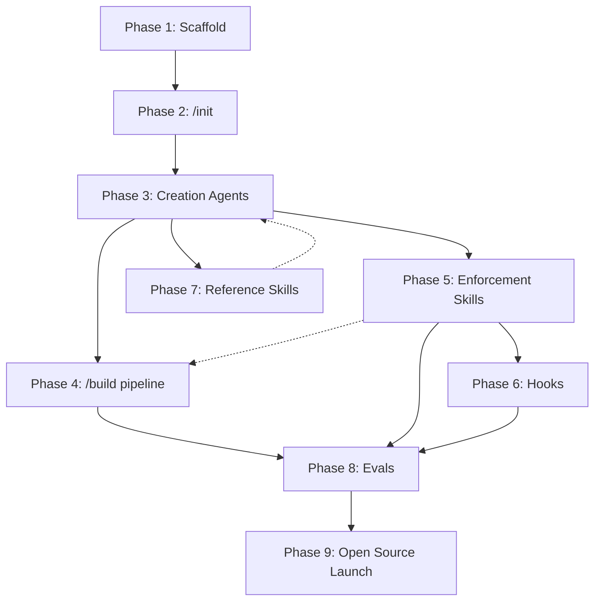

# React Craft Plugin — Implementation Plan

## Phase 1: Plugin Scaffold & Marketplace Setup
> Goal: A valid, installable Claude Code plugin with no functionality yet.

- [ ] **1.1** Initialize git repo in this directory
- [ ] **1.2** Create marketplace structure:
  ```
  .claude-plugin/marketplace.json
  plugins/react-craft/.claude-plugin/plugin.json
  plugins/react-craft/README.md
  plugins/react-craft/CHANGELOG.md
  plugins/react-craft/LICENSE (MIT — confirmed)
  ```
- [ ] **1.3** Write `plugin.json` with metadata (name, version 0.1.0, description, author, keywords, homepage)
- [ ] **1.4** Write `marketplace.json` following Claude Code spec (name, owner, metadata, plugins array)
- [ ] **1.5** Verify local installation works: `claude /plugin marketplace add <path>` + `claude /plugin install react-craft`
- [ ] **1.6** Create initial README with vision statement, installation instructions, and compatibility matrix (standalone / +CE / +BMAD)

### Deliverable
A plugin that installs and shows up in Claude Code with zero commands/agents.

---

## Phase 2: `/react-craft:init` Command
> Goal: Detect codebase setup and write `react-craft.config.yaml` + update CLAUDE.md as the constitutional documents all agents read.

- [ ] **2.1** Create `plugins/react-craft/commands/init.md`
- [ ] **2.2** Detection logic (via Bash file-existence checks + grep):
  - Styling method: Tailwind (tailwind.config), CSS Modules (*.module.css), styled-components (package.json dep), vanilla CSS
  - Component naming: scan existing components for PascalCase/kebab-case patterns
  - Prop naming: scan for camelCase/kebab-case prop conventions
  - CSS class naming: scan for BEM, utility-first, or other patterns
  - Design tokens: check for DTCG `.tokens.json`, CSS custom properties, Tailwind theme
  - Storybook config: detect version, addons, story naming convention
  - Design system library: check package.json for MUI, Radix, Chakra, Headless UI, etc.
  - Available scripts: detect lint, format, test, storybook commands from package.json
  - i18n framework: detect react-intl, i18next, next-intl, vue-i18n from imports
  - Content strategy: detect tone guides, terminology files, content docs
- [ ] **2.3** Interactive prompts for what can't be detected:
  - Where do design tokens live?
  - What's the component directory structure?
  - Any content strategy / i18n setup?
  - Figma Console MCP vs Official Figma MCP availability?
- [ ] **2.4** Write `react-craft.config.yaml` (not markdown — YAML for machine parsing, following prior toolkit pattern):
  - `design_system` section: name, version, storybook_url, manifest_cache, component_prefix, **support_channel** (URL), **support_label** (human-readable)
  - `skills` section: per-skill enabled/disabled + config
  - `pipeline` section: ordered list of agents + skills + custom skill slots
  - `hooks` section: post_edit, pre_commit with file patterns and severity gates
  - `scope` and `severity` sections
  - `allowlist` for known intentional deviations
- [ ] **2.5** Prompt for DS team support channel URL + label (e.g., "#design-system-help on Slack")
- [ ] **2.6** Add CLAUDE.md instructions for semantic hooks (post-edit token checking, pre-commit audit reminder)
- [ ] **2.7** Generate `hooks/hooks.json` for shell-based fast checks (hardcoded color grep, commit warning)
- [ ] **2.8** Test: run `/react-craft:init` on 3 different project types (Tailwind + Radix, CSS Modules + custom, styled-components + MUI)

### Deliverable
Running `/react-craft:init` produces `react-craft.config.yaml`, updates CLAUDE.md, and configures hooks.

---

## Phase 3: Core Agents (Sequential Build)
> Goal: Build each agent individually, test in isolation, then wire together.

### 3.1 Design Analyst Agent
- [ ] **3.1.1** Create `plugins/react-craft/agents/design-analyst.md`
- [ ] **3.1.2** Persona: design system maintainer focused on token adherence, visual consistency, variant coverage
- [ ] **3.1.3** Input: Figma link or Anova YAML export
- [ ] **3.1.4** Process: Extract specs via Figma Console MCP (fallback to Official Figma MCP), parse Anova output if provided
- [ ] **3.1.5** **Critical action: NEVER fill gaps by guessing.** After extracting what Figma provides, the agent must audit the brief for completeness against a checklist:
  - [ ] All interactive states documented? (hover, focus, active, disabled)
  - [ ] Loading, error, and empty states defined?
  - [ ] Responsive behavior specified? (breakpoints, reflow, hiding)
  - [ ] Motion/animation intent clear? (or explicitly "none")
  - [ ] Content rules known? (min/max lengths, truncation, i18n)
  - [ ] Keyboard interaction pattern defined?
  - [ ] Token mapping complete? (no ambiguous "looks like gray")

  For each gap, the agent **stops and asks the human**, requesting:
  - A specific answer ("What happens to this component below 768px?")
  - Or a link to a specific Figma frame/node that clarifies it ("Can you share the Figma link for the mobile variant?")

  Requesting node-level links (`figma.com/file/...?node-id=X:Y`) rather than full file links keeps token usage efficient when the agent fetches context.
- [ ] **3.1.6** Output: Structured component brief (markdown) including:
  - Component name, description, purpose
  - All variants with visual diffs (from Anova)
  - Design tokens used (colors, spacing, typography, shadows)
  - Responsive behavior notes
  - Motion/animation specs
  - States: default, hover, focus, active, disabled, loading, error, empty
  - Content requirements (min/max lengths, truncation rules)
  - **Gaps section**: any items the human still needs to clarify, marked `[PENDING]`
- [ ] **3.1.7** **Gate: Do not proceed to Component Architect until all `[PENDING]` items are resolved.** The brief must be complete before downstream agents consume it.
- [ ] **3.1.8** Template: `plugins/react-craft/templates/component-brief.md` (include the completeness checklist)
- [ ] **3.1.9** Test: Run against a Material Design button component in Figma
- [ ] **3.1.10** Test: Run against a component with intentionally incomplete Figma specs, verify agent asks questions instead of guessing

### 3.2 Component Architect Agent
- [ ] **3.2.1** Create `plugins/react-craft/agents/component-architect.md`
- [ ] **3.2.2** Persona: library author focused on API ergonomics, composability, prop naming
- [ ] **3.2.3** Input: Component brief from Design Analyst + `react-craft.config.md`
- [ ] **3.2.4** Process:
  - Break complex components into atomic parts (identify composition opportunities)
  - Define TypeScript prop interface with JSDoc
  - Map variants to props (boolean flags vs. union types vs. compound components)
  - Check existing component inventory (from config) for reuse opportunities
  - For complex components: research existing libraries (Radix, Headless UI, React Aria, etc.) via web search + context7
- [ ] **3.2.5** Output: Component architecture doc appended to the component brief:
  - File structure (which files to create)
  - Prop interface (TypeScript)
  - Composition strategy (compound components, render props, slots)
  - Dependencies (existing design system components, external libraries if needed)
  - Accessibility requirements (ARIA roles, keyboard interactions)
- [ ] **3.2.6** Critical action: MUST prefer existing design system components over creating new ones
- [ ] **3.2.7** When no DS equivalent exists: nudge developer to check with DS team (using `support_channel` from config) before building custom
- [ ] **3.2.8** Test: Run against a complex component (data table with sorting/filtering/pagination)

### 3.3 Code Writer Agent
- [ ] **3.3.1** Create `plugins/react-craft/agents/code-writer.md`
- [ ] **3.3.2** Persona: senior React developer, follows detected conventions
- [ ] **3.3.3** Input: Component brief (with architecture section) + `react-craft.config.md`
- [ ] **3.3.4** Critical actions:
  - Read `react-craft.config.md` FIRST for styling method, naming conventions, token usage
  - Semantic HTML elements first (`<button>`, `<nav>`, `<dialog>`, `<details>`)
  - Platform features for forms, hovers, buttons, URLs
  - JS client-side features only when CSS/HTML can't do it
  - Mobile-first responsive with native features
  - `prefers-reduced-motion` for any animation
  - Forward refs, proper TypeScript generics where needed
- [ ] **3.3.5** Output: React component file(s) + index barrel export
- [ ] **3.3.6** Test: Generate a card component with Tailwind, then same with CSS Modules — verify convention adherence

### 3.4 Accessibility Auditor Agent
- [ ] **3.4.1** Create `plugins/react-craft/agents/accessibility-auditor.md`
- [ ] **3.4.2** Persona: user with disabilities — keyboard nav, screen reader, motion sensitivity, color contrast
- [ ] **3.4.3** Input: Generated component files (fresh context — no knowledge of implementation decisions)
- [ ] **3.4.4** Process:
  - Static analysis: check for semantic HTML, ARIA attributes, role assignments
  - Run Storybook a11y addon (axe-core) via Storybook MCP + CLI
  - Check keyboard interaction patterns against WAI-ARIA Authoring Practices
  - Verify `prefers-reduced-motion` handling
  - Check color contrast ratios
  - Verify focus management and focus trapping (modals, dropdowns)
- [ ] **3.4.5** Output: Accessibility report with severity levels (P1 blocker / P2 should fix / P3 enhancement)
- [ ] **3.4.6** P1 findings trigger automatic remediation (Code Writer re-invoked, max 3 attempts)
- [ ] **3.4.7** Test: Intentionally generate a component with a11y issues, verify they're caught

### 3.5 Story Author Agent
- [ ] **3.5.1** Create `plugins/react-craft/agents/story-author.md`
- [ ] **3.5.2** Persona: QA engineer — edge cases, error states, loading states, empty states, overflow
- [ ] **3.5.3** Input: Component brief + generated component files + `react-craft.config.md`
- [ ] **3.5.4** Process:
  - Create stories for EVERY state listed in the component brief
  - Write Storybook interaction tests using `@storybook/test` (play functions)
  - Include a11y test story (uses addon-a11y)
  - Follow CSF Factories pattern (Storybook 10)
  - Test responsive behavior at breakpoints (mobile, tablet, desktop)
  - Test with long content, empty content, RTL if applicable
- [ ] **3.5.5** Output: `ComponentName.stories.tsx` with interaction tests
- [ ] **3.5.6** Verify: Run `storybook test` via CLI, all stories must render without errors
- [ ] **3.5.7** Test: Generate stories for a form field component, verify edge case coverage

### 3.6 Visual Reviewer Agent
- [ ] **3.6.1** Create `plugins/react-craft/agents/visual-reviewer.md`
- [ ] **3.6.2** Persona: pixel-perfect designer
- [ ] **3.6.3** Input: Figma link + Storybook story URL (from Storybook MCP)
- [ ] **3.6.4** Process:
  - Screenshot Figma design (via Figma MCP or provided screenshot)
  - Screenshot Storybook story (via Playwright MCP)
  - Compare across 9 dimensions: layout, typography, colors, spacing, shadows, borders, border-radius, icons, states
  - Classify discrepancies by severity (critical/moderate/minor)
  - For critical/moderate: identify single most impactful fix
  - Apply fix, re-screenshot, re-compare
  - Max 5 iterations. Structure fixes before polish fixes.
- [ ] **3.6.5** Output: Visual comparison report + any applied fixes
- [ ] **3.6.6** Early termination: stop if no clear improvement identifiable
- [ ] **3.6.7** Test: Deliberately misalign spacing, verify detection and fix

### 3.7 Quality Gate Agent
- [ ] **3.7.1** Create `plugins/react-craft/agents/quality-gate.md`
- [ ] **3.7.2** Input: All generated files + `react-craft.config.md` (for script commands)
- [ ] **3.7.3** Checks (using detected scripts from config):
  - TypeScript compilation (`tsc --noEmit`)
  - Linting (detected linter)
  - Formatting (detected formatter)
  - Storybook test runner (`storybook test`)
  - Bundle size check (if configured)
- [ ] **3.7.4** Three-path failure handling: Fix (auto) / Defer (TODO) / Accept (logged)
- [ ] **3.7.5** Output: Quality report with PASS/FAIL per check
- [ ] **3.7.6** Test: Introduce a lint error, verify catch and auto-fix

### Deliverable
7 agents that each work independently with clear inputs/outputs.

---

## Phase 4: Pipeline Orchestration (`/react-craft:build`)
> Goal: Wire agents into the full sequential pipeline with quality gates.

- [ ] **4.1** Create `plugins/react-craft/commands/build.md`
- [ ] **4.2** Implement complexity assessment:
  - Simple (button, badge, icon): agents 1 → 3 → 5 → 7
  - Medium (card, form field, dropdown): agents 1 → 2 → 3 → [4,5 parallel] → 6 → 7
  - Complex (data table, wizard, editor): agents 1 → 2 (with library research) → 3 → [4,5 parallel] → 6 → 7, multi-pass, user gates
- [ ] **4.3** Implement artifact chain: each agent writes to `docs/react-craft/components/<ComponentName>/`
  - `brief.md` (Design Analyst output, updated by Component Architect)
  - Component files in project source tree
  - `stories.tsx` in project source tree
  - `review.md` (a11y + visual + quality reports)
- [ ] **4.4** Implement remediation loop: if gates fail, re-invoke Code Writer with failure context, max 3 attempts
- [ ] **4.5** Implement step-file sharding: each agent loads only its own prompt + config + component brief
- [ ] **4.6** Test: Full pipeline on a medium-complexity component (dropdown)

### Deliverable
`/react-craft:build <figma-link>` produces a complete, tested, accessible React component.

---

## Phase 5: Enforcement Skills (Port from Prior Toolkit)
> Goal: Bundle the 4 enforcement skills from the 2026-03-05 frontend-agent-toolkit as built-in review capabilities.

- [ ] **5.1** Port `design-system-guardian` skill + `references/matching-rules.md` into `plugins/react-craft/skills/`
- [ ] **5.2** Port `token-validator` skill (add DTCG `.tokens.json` support as primary format)
- [ ] **5.3** Port `implementation-checker` skill (a11y, keyboard, states, focus management)
- [ ] **5.4** Port `deviation-tracker` skill (classification + YAML reports + `@ds-deviation` parsing)
  - **Add DS team nudge:** All `needs-review` findings must include `support_channel` URL from config
  - Nudge text: "Not sure if this is intentional? Check with the DS team: {support_label} ({support_channel})"
  - Include `support_channel` in YAML report metadata for machine consumption
- [ ] **5.5** Port the `frontend-review` workflow orchestrator as the `/react-craft:audit` command
- [ ] **5.6** Adapt config schema to merge prior `.frontend-toolkit.yaml` into `react-craft.config.yaml`
- [ ] **5.7** Wire enforcement skills into the `/build` pipeline as post-creation quality gates
- [ ] **5.8** Port `examples/react-component/TaxCategoryPicker.tsx` + `EXPECTED_FINDINGS.md` as eval fixture
- [ ] **5.9** Port `examples/custom-skills/i18n-checker/SKILL.md` as a bundled example custom skill
- [ ] **5.10** Test: Run audit against TaxCategoryPicker, verify findings match EXPECTED_FINDINGS.md

### Deliverable
`/react-craft:audit src/components/Button` runs Guardian + Token Validator + Implementation Checker + Deviation Tracker and produces an actionable report. Custom skills (i18n, content strategy) can be added to the pipeline via config.

---

## Phase 6: Hooks Infrastructure
> Goal: Auto-trigger checks on Claude Code lifecycle events.

- [ ] **6.1** Create `plugins/react-craft/hooks/hooks.json` with:
  - `PostToolUse` (Edit|Write on UI files): grep for hardcoded colors, warn
  - `PostToolUse` (Write on .tsx/.jsx): suggest running audit for new UI files
  - `PreToolUse` (Bash with git commit): list UI files in commit, suggest audit
- [ ] **6.2** Add optional `SubagentStop` hook: after Code Writer agent completes, auto-trigger Accessibility Auditor
- [ ] **6.3** Add optional `Stop` hook: agent-type hook that verifies quality gates passed before Claude stops responding
- [ ] **6.4** Document hook customization in README (how to add/remove/modify hooks)
- [ ] **6.5** Test: Edit a .tsx file, verify PostToolUse hook fires and warns about hardcoded values

### Deliverable
Hooks auto-fire on edit, write, and commit events. Teams can customize which hooks are active.

---

## Phase 7: Reference Skills
> Goal: Bundled knowledge that agents reference for domain-specific best practices.

- [ ] **7.1** Create `plugins/react-craft/skills/react-craft/SKILL.md` (core skill definition)
- [ ] **7.2** Create `plugins/react-craft/skills/react-craft/references/`:
  - `react-patterns.md` — React 18 patterns (composition, hooks, refs, portals, suspense boundaries)
  - `accessibility.md` — WCAG 2.2 checklist, ARIA authoring practices, keyboard interaction patterns
  - `storybook-testing.md` — Storybook 10 interaction tests, CSF Factories, a11y addon, play functions
  - `responsive-mobile-first.md` — Mobile-first breakpoints, native features, container queries
  - `motion-animation.md` — Functional animation patterns, reduce-motion, CSS vs JS transitions
  - `component-api-design.md` — Prop naming, compound components, polymorphic components, generic constraints
- [ ] **7.3** Each reference loaded on-demand by the relevant agent (not all at once)

### Deliverable
Rich reference library that agents pull from as needed without overwhelming context.

---

## Phase 8: Eval Infrastructure
> Goal: Measurable quality tracking with public benchmarks.

- [ ] **8.1** Create `plugins/react-craft/commands/eval.md`
- [ ] **8.2** Create `plugins/react-craft/skills/eval-runner/SKILL.md`
- [ ] **8.3** Create fixture directory: `plugins/react-craft/evals/fixtures/`
- [ ] **8.4** Collect Figma files for fixtures:
  - Google Material Design components (button, text field, card, dialog, data table)
  - Apple HIG components (toggle, segmented control, navigation bar)
  - Other popular design systems (variety of complexity levels)
- [ ] **8.5** Define deterministic graders:
  - TypeScript compiles without errors
  - ESLint passes
  - Storybook stories render without errors
  - axe-core reports zero violations
  - All interaction tests pass
  - Enforcement skills produce expected findings (vs. EXPECTED_FINDINGS.md)
- [ ] **8.6** Define LLM-as-judge graders:
  - Visual fidelity (screenshot comparison scoring 1-10)
  - Component API quality (prop interface review)
  - Code readability and convention adherence
  - Design system compliance (Guardian/Token Validator findings count)
- [ ] **8.7** Implement benchmark tracking: token usage, time, pass rate per agent per fixture
- [ ] **8.8** Create eval results template for reproducible reports
- [ ] **8.9** Set up A/B testing capability: compare skill versions via blind comparison
- [ ] **8.10** Port TaxCategoryPicker + EXPECTED_FINDINGS.md as first eval fixture

### Deliverable
`/react-craft:eval` runs the full fixture suite and produces a scored benchmark report.

---

## Phase 9: Documentation & Open Source Launch
> Goal: Professional open-source presence.

- [ ] **9.1** Write comprehensive README:
  - Vision and philosophy (20 years of frontend craft)
  - Quick start (install + init + build)
  - Architecture overview (agent team, pipeline, quality gates)
  - Compatibility matrix (standalone / +CE / +BMAD)
  - Contributing guide (adding fixtures, improving agents)
- [ ] **9.2** Create docs site (static HTML, GitHub Pages)
  - Landing page with demo video
  - Agent reference pages
  - Command reference pages
  - Eval results dashboard
  - Custom skill authoring guide (how to write i18n/content strategy/etc. skills)
  - Hooks reference (which hooks ship, how to customize)
- [ ] **9.3** Write CONTRIBUTING.md (how to add fixtures, improve agents, write custom skills, run evals)
- [ ] **9.4** Set up GitHub Actions for:
  - Eval suite on PR
  - Plugin JSON validation
  - Changelog generation
- [ ] **9.5** Create demo video showing full pipeline
- [ ] **9.6** Create "Write a Custom Skill" tutorial (using i18n-checker as example)

### Deliverable
A polished open-source repo ready for community adoption.

---

## Execution Order & Dependencies



- Phases 4, 5, 6, and 7 can be worked in parallel once Phase 3 agents exist
- Phase 5 (enforcement) feeds into Phase 4 (build pipeline) as quality gates
- Phase 6 (hooks) depends on Phase 5 (needs enforcement skills to trigger)
- Phase 8 (evals) requires pipeline + enforcement + hooks to be functional
- Phase 7 (references) informs Phase 3 agents but can be refined iteratively

## Prior Work Reference

The following files from `../2026-03-05-bmad-vs-ce/` should be ported or referenced:
- `skills/design-system-guardian/` → Port into Phase 5
- `skills/deviation-tracker/` → Port into Phase 5
- `workflows/frontend-review/` → Port as `/react-craft:audit` orchestrator
- `config/example-full.yaml` → Basis for `react-craft.config.yaml` schema
- `config/example-hooks.json` → Basis for `hooks/hooks.json`
- `examples/custom-skills/i18n-checker/` → Bundle as example custom skill
- `examples/react-component/` → Port as eval fixture

## Documented Extension Points (Not Built Yet)

### Figma-to-Code Drift Checker
A future custom pipeline skill that compares Figma Console MCP output (design truth) against Storybook MCP manifest (code truth) to identify drift: missing variants, renamed props, deprecated patterns, new tokens. Classifies as code-behind / figma-behind / conflict and guides resolution. The existing pipeline extensibility (`skill: custom`), `@ds-deviation` comments, Deviation Tracker classification, and DS team `support_channel` nudges all support this use case without architectural changes. See brainstorm for full design.

## Open Questions (All Resolved)

1. ~~Plugin name~~ → **react-craft**
2. ~~Eval fixtures~~ → Actual Figma files from Material, Apple HIG, and other popular design systems
3. ~~Extensibility for i18n/content strategy~~ → Custom pipeline steps via `skill: custom` in config
4. ~~Hooks integration~~ → Shell-based PostToolUse + PreToolUse + CLAUDE.md semantic hooks
5. ~~MCP server~~ → **No.** Not shipping a custom MCP server.
6. ~~License~~ → **MIT**
7. ~~Batch mode~~ → **Not for now.** Building one component correctly is hard enough. Defer to future version.
8. ~~Enforcement skill parallelism~~ → **Parallel when safe, sequential when there's toe-stepping risk.** Specifically: Guardian + Token Validator + Implementation Checker can run in parallel (they're read-only, analyzing the same files independently). Deviation Tracker always runs last (it consumes all findings). Custom skills run sequentially if they might modify files, parallel if read-only.
